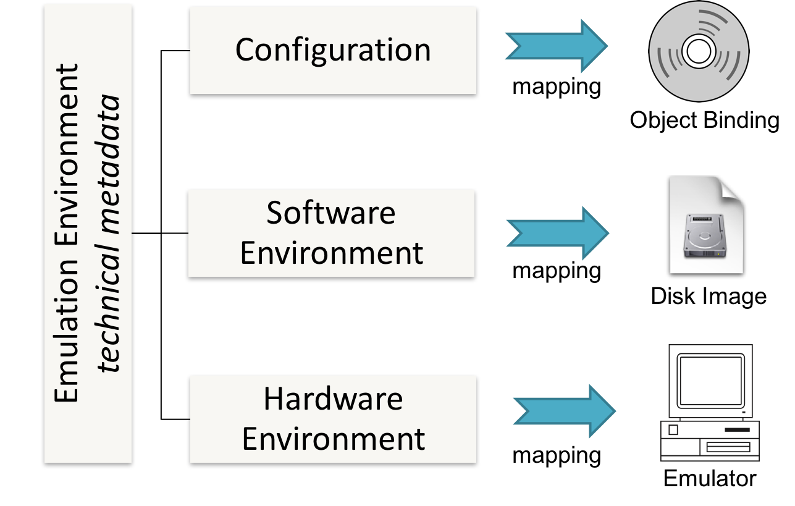

# Emulation Environments

An emulation environment describes a complete emulation setup:



The current EaaS implementation of an emulation environment has the following structure:

```XML
<emulationEnvironment xmlns="http://bwfla.bwl.de/common/datatypes">
 
    <!-- Header -->

    <!-- UI Options-->

    <!-- Drive Definitions --> 

    <!-- Bindings -->

    <!-- Native Config -->
  
</emulationEnvironment> 
```

## Header

The emulation environment's header components define filds common to all emulators:

+ `id` (String): unique identifier of the environment
+ `description`: descriptive information 
  + `title` (String)
  + `os` (String)
+ `arch` (Enumeration): currently supported only be Qemu: `i386`,`ppc`
+ `emulator` (String): a EaaS EmulatorBean implementation. An emulator bean integrates a specific emulator into the framework. 
  + Supported beans:
    BasiliskII (example)  
    Beebem (example) 
    DosBox (examples: [Doom](./examples/doom.env))
    Hatari (example: [Atari](.examples/hatari_tOS206us.env)) 
    Kegs (example) 
    PceAtari (example) 
    PceIbmPc (example) 
    PceMacPlus (example) 
    Qemu (examples: [Dos 6.2](./examples/dos620_cdrom.env) [Win 3.11](./examples/win311.env)) 
    SheepShaver (examples: [MacOS9](./examples/macos9.env)) 
    ViceC128 (example) 
    ViceC64 (example) 
    VirtualBox (example) 
 
Example: 
```XML
<emulationEnvironment xmlns="http://bwfla.bwl.de/common/datatypes">
    <id>2010</id>
    <description>
        <title>Microsoft DOS 6.20 (CD-ROM)</title>
        <os>dos</os>
    </description>
    <arch>i386</arch>
    <emulator bean="Qemu" />

    <!-- ... -->
</emulationEnvironment>
```

## UI Options
The UI Options allow to configure presentation features.
+ `HTML5`: HTML5 presentation options 
⋅⋅+ `pointer_lock` (boolean): Enables the HTML5 pointer lock ([more information here](https://developer.mozilla.org/en-US/docs/Web/API/Pointer_Lock_API). Useful if the emulator or the operating system do not support absolute mouse positions (e.g. Windows 3.11). 
⋅⋅+ `clientKbdLayout` (String): the user's keyboard layout. 

Eaxmple:
```XML
<ui_options>
  <html5> 
     <pointer_lock>false</pointer_lock>
  </html5>
  <input>
     <clientKbdLayout>de</clientKbdLayout>
  </input>
</ui_options>
```  

## Drive Definitions
Drive definitions define usable drives of for an emulation environment. Drives may have empty `data` tags (e.g. to define an empty CDROM drive to be bound by a workflow) or predifined data sources (c.f. the Bindings section).

+ `data` (String): URL to a data source. Supported URL types are: http, nbd, binding, file. 
+ `type` (Enumeration): Drive types: cdrom, floppy, disk, iso
+ `iface`, `bus`, `unit`: Emulator / bean specific, sees examples. 

Example, defining three drives (floppy, cdrom and disk). The floppy and cdrom drive are unbound yet:
```XML
<drive>
  <data></data>
  <iface>ide</iface>
  <bus>0</bus>
  <unit>1</unit>
  <type>cdrom</type>
  <boot>false</boot>
  <filesystem>ISO</filesystem>
 </drive>

 <drive>
  <data></data>
  <iface>floppy</iface>
  <bus>0</bus>
  <unit>0</unit>
  <type>floppy</type>
  <boot>false</boot>
  <filesystem>fat12</filesystem>
 </drive>
 
 <drive>
  <data>binding://main_hdd</data>
  <iface>ide</iface>
  <bus>0</bus>
  <unit>0</unit>
  <type>disk</type>
  <boot>true</boot>
  <plugged>true</plugged>
 </drive>
```

## Bindings

Bindings describes/defines data sources. 
+ `id` (String): ID of the binding to be referenced within an environment. 
+ `url` (String): URL to a data source.  
+ `access` (Enumeration): copy or cow (copy on write). 

Example, creates a new "main_hdd" binding to be used with a drive. The url references to an image file stored in the configured image-archive. 
```XML
 <binding id="main_hdd">
  <url>imagearchive:qemu-i386-DOS_6.20_CDROM.raw</url>
  <access>cow</access>
 </binding>
```

## Native Config
The native config allows to pass emulator specific options to the emulator. See SheepShaver examples.    
